# Practice: Analyze PsExec

## 1. PsExec

- **PsExec** is a remote command execution tool for system administrators that is included in the **Sysinternals Suite**. However, it is also commonly used for **lateral movement** in targeted attacks.

### Important PsExec Options

- **`-r`** → Changes the copied file name and the service name on the remote computer.
  - Default executable: `%SystemRoot%\PSEXESVC.exe`
  - Default service name: `PSEXESVC`
- **`-c`** → Copies a program to the remote computer.
  - The program is copied to the `Admin$` share (`%SystemRoot%`).
- **`-s`** → Executes the command using the **SYSTEM** account.
- **`-u`** → Uses specific credentials to log on to the remote computer.
  - **Logon Type 2** and **Logon Type 3** may occur.

---

## 2. Typical Behavior of PsExec

PsExec typically performs the following actions:

1. Copies the PsExec service executable (`PSEXESVC.exe` by default) to the `%SystemRoot%` directory on the remote computer using a **Network Logon (Logon Type 3)**.

2. Registers a service named `PSEXESVC` by default and starts the service to execute the specified command on the remote computer.

3. Stops the service and removes the service from the remote computer after execution.

---

## 3. Important Event IDs

### Security.evtx

- **Event ID 4624** → An account was successfully logged on.
  - **Logon Type 3** → Network logon.

### System.evtx

- **Event ID 7045** → A service was installed in the system.

---

## 4. Network Diagram

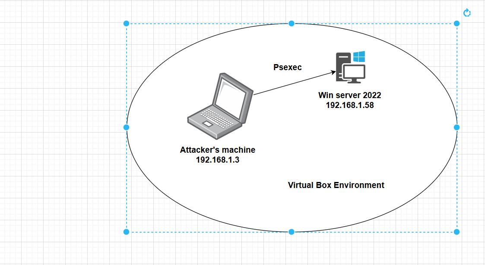

---

## 5. Detect PsExec by the Default Service Name

### 5.1. Log On to Windows Server 2022

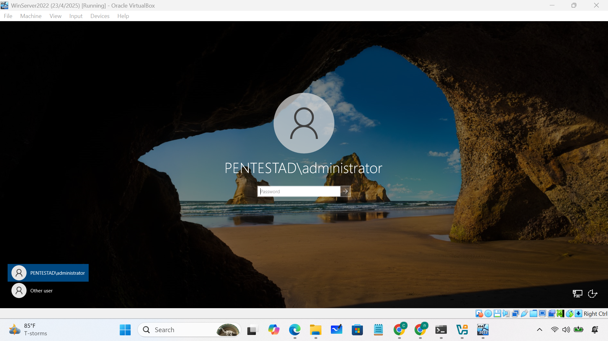

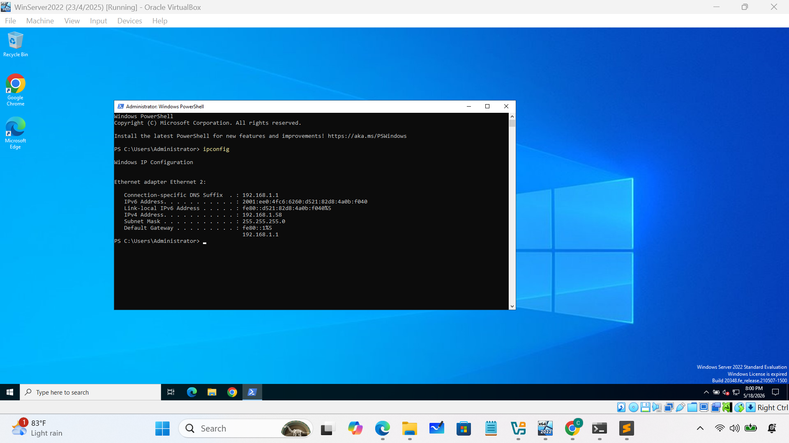

### 5.2. Run PsExec from the Attacker's Machine

**Attacker IP:** `192.168.1.3`

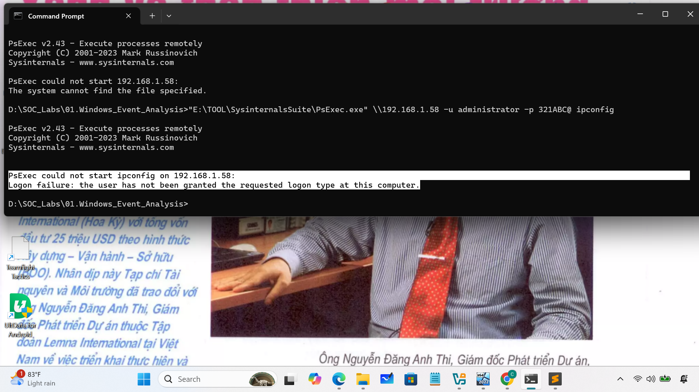

### 5.3. Logon Type Error

An error occurred indicating that the user had not been granted the requested logon type.

To resolve this issue, configure the Windows Server to allow the required **network logon** permission.

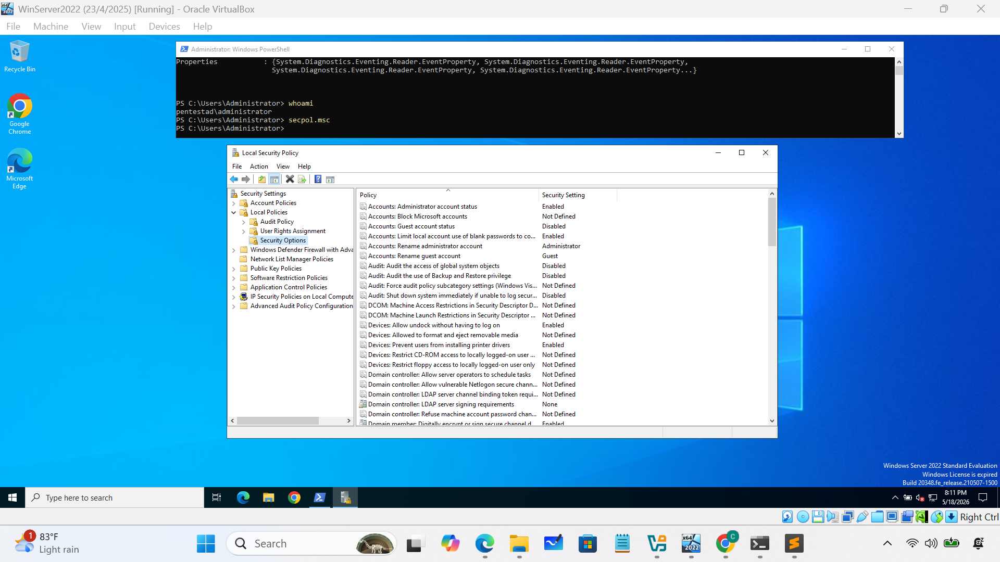

### 5.4. Run PsExec Again

### 5.5. Analyze Events on Windows Server 2022

Switch to Windows Server 2022 and analyze the related event logs.

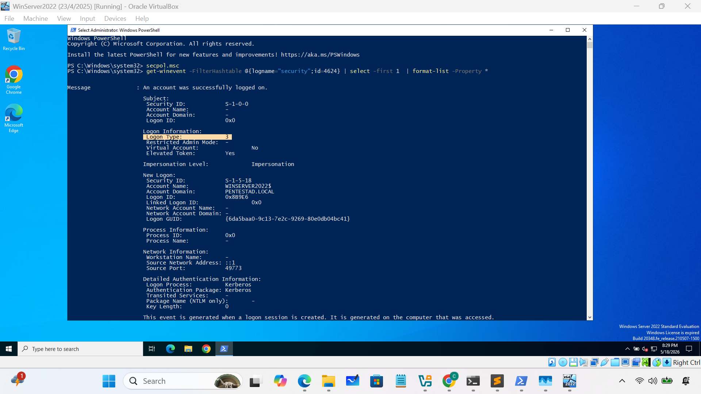

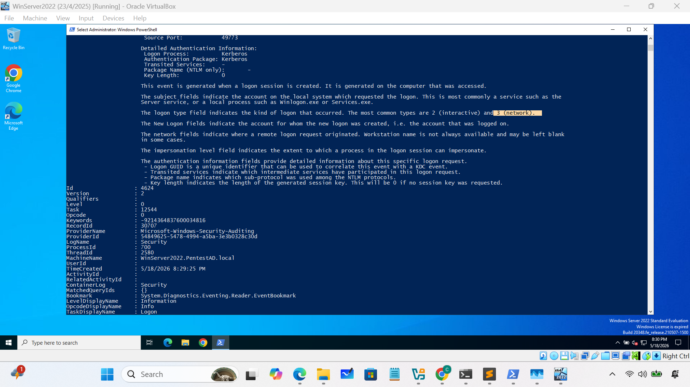

### 5.6. Conclusion

We found the following events:

- **Event ID 4624**
  - Logon Type: **3**
  - Timestamp: **5/18/2026 8:29:25 PM**

- **Event ID 7045**
  - Service name: **PSEXEC.exe**
  - Timestamp: **5/18/2026 8:28:17 PM**

Therefore, we can consider that the attacker used **PsExec** to execute commands on the Windows Server 2022 machine.

---

## 6. Detect PsExec by Finding a Changed Service Name

If an attacker changes the executable name and service name of PsExec using the **`-r`** option, we can still detect PsExec execution based on the following characteristics:

- The PsExec service executable (`PSEXESVC.exe` by default) is copied to the `%SystemRoot%` directory on the remote computer.
- The service name is the same as the executable name without the `.exe` extension.
- The service is executed in **user mode**, not kernel mode.
- The **LocalSystem** account is used as the service account.
- The actual user account is used to execute the service executable rather than the `SYSTEM` account.

### 6.1. Run PsExec with the `-r` Option

Run PsExec with the `-r` option to change the default executable and service name.

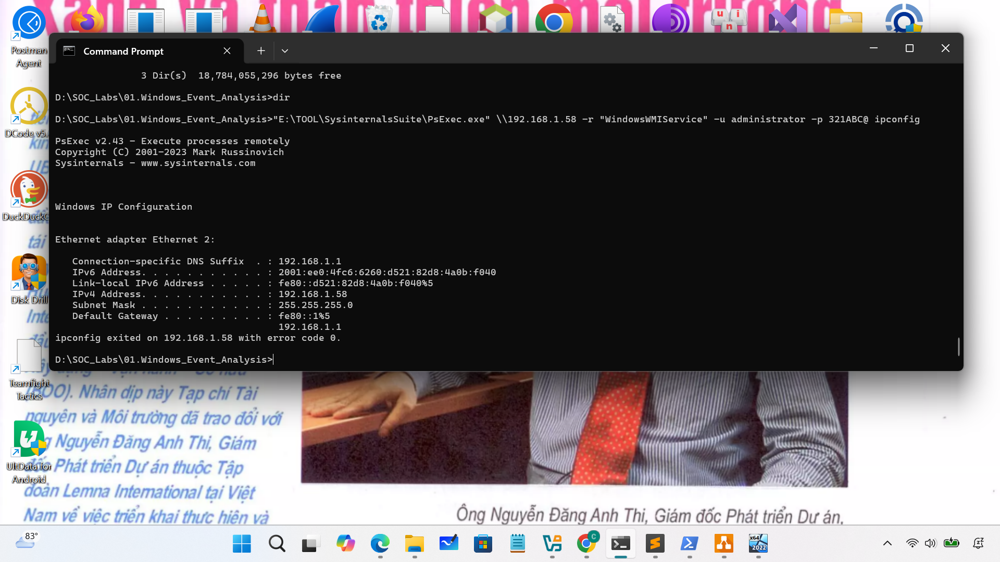

### 6.2. Analyze Event Logs on Windows Server 2022

Switch to Windows Server 2022 and analyze the event logs.

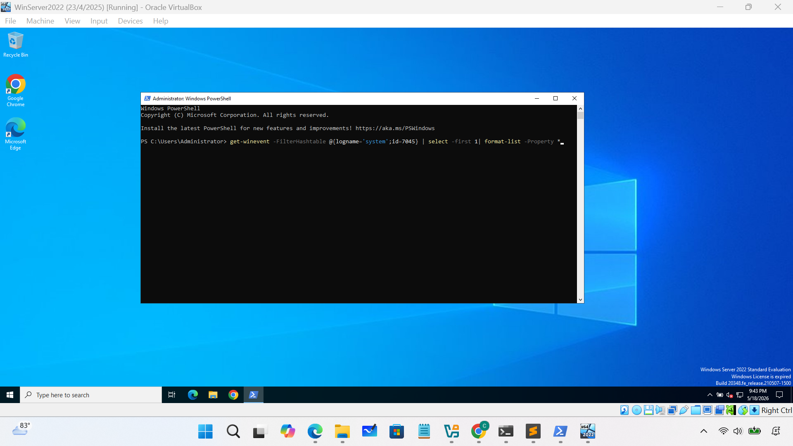

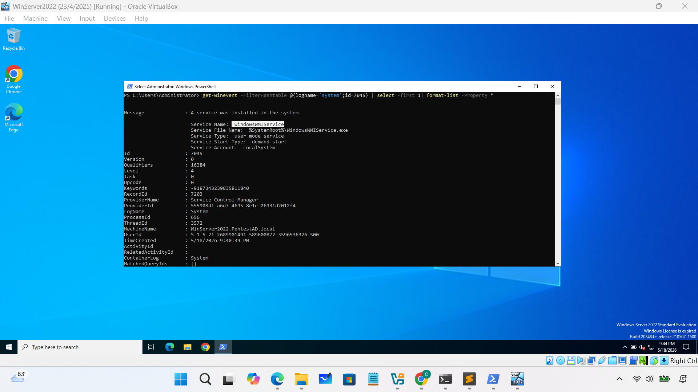

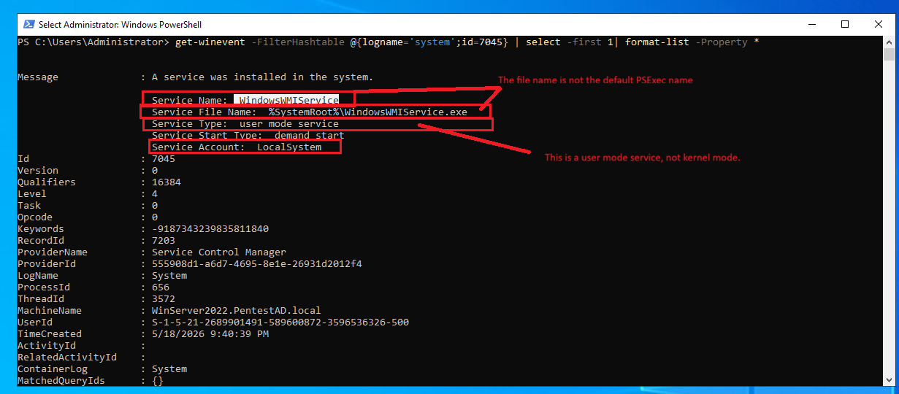
