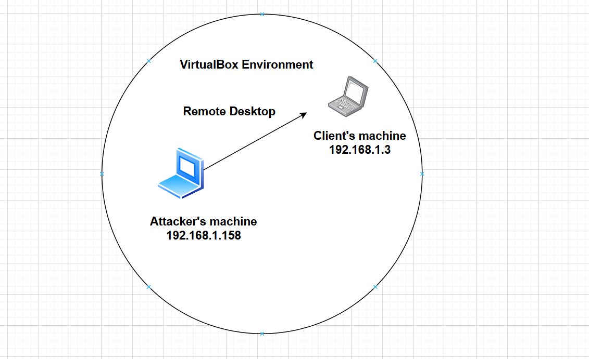
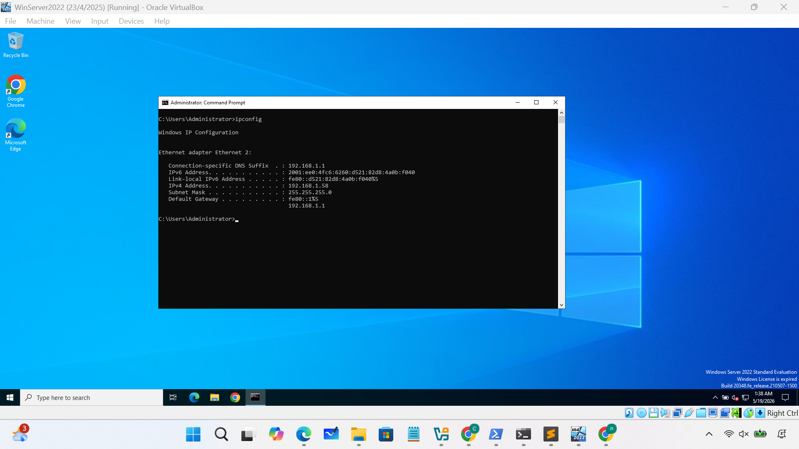
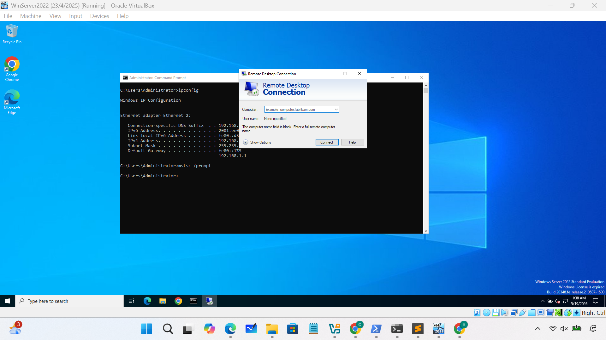
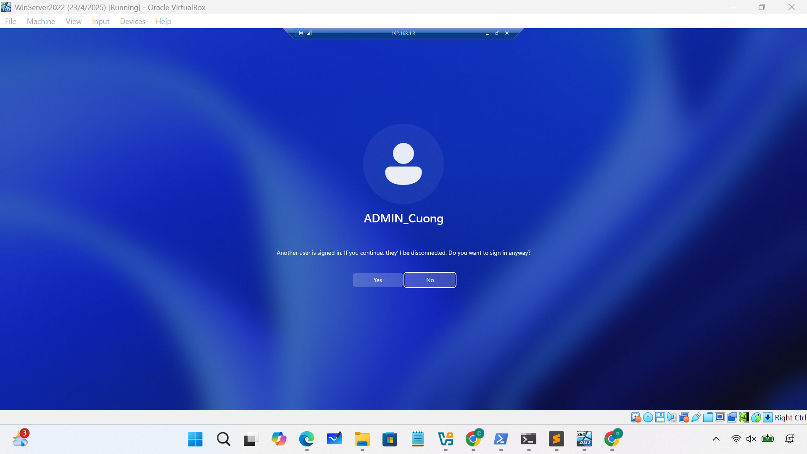
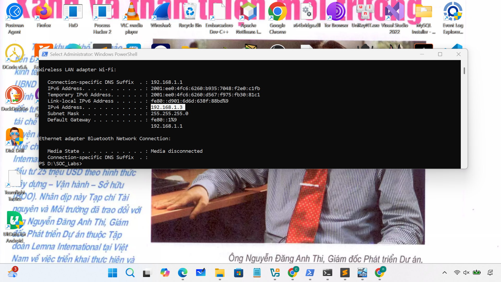
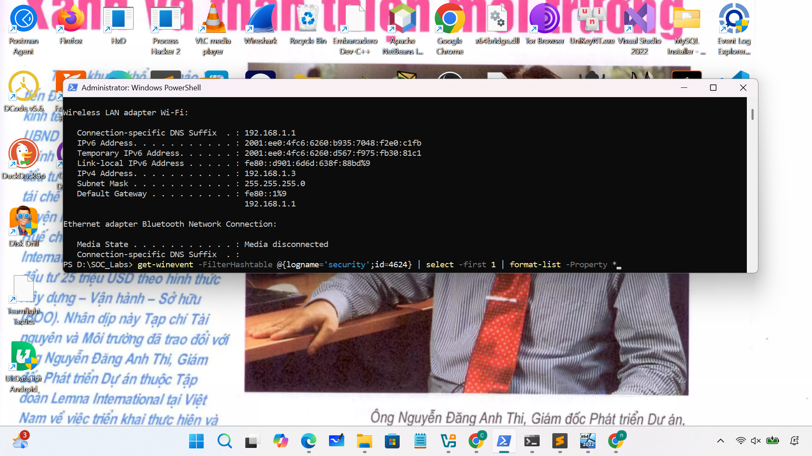
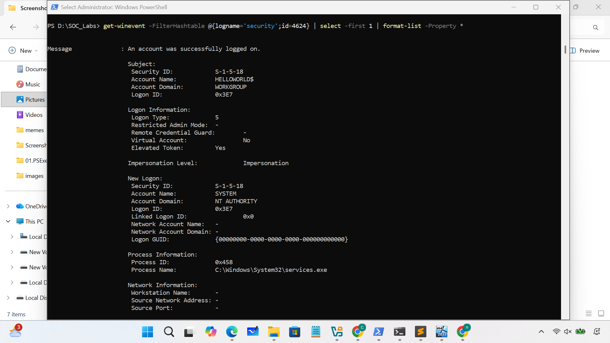
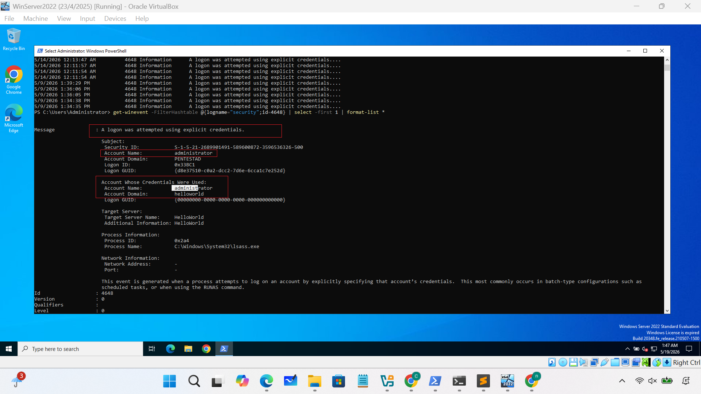

# Practice analyze RDP

### 1.Remote Desktop Protocol

- **Why this event is important?**
	- Attackers sometimes use RDP to logon to remote computers while users are away from clients, or to penetrate servers. So, you should check this event. 
- **Important event IDs**
	- Security.evtx	
		-  4624: An account was successfully logged on
		-  4648: A logon was attempted using explicit credentials.
		- 4778: A session was reconnected to a Window Station. (Not default)
### 2.How can detect this event?
```text
- Logon with RDP
	• 4624 (Security.evtx)
		• Description
			• An account was successfully logged on.
		• How can we recognize RDP logon with this ID?
			• Filter with these logon types in this ID.
				• Logon type 10 (RemoteInteractive) or type 12 (CachedRemoteInteractive)
		• Why?
				• RemoteInteractive(10) and CachedRemoteInteractive(12) indicate RDP used clearly because these logon types are dedicated for RDP usage.
	• 4648 (Security.evtx)
		• Description
			• A logon was attempted using explicit credentials.
		• How can we recognize RDP logon with this ID?
			• Find events with the following conditions.
			• Filter out computer accounts and localhost
		• Why?
			• If a user inputs a credential clearly when the user logs on to remote machines with RDP, then 
this ID is logged at the source machine.
			• But when “Restricted Admin mode” is used, this ID is not logged for the admin accounts.
```

### 3.Network diagram 

### 4. Analyze RDP events
- On Attacker's machine, Creating a connection using RDP



- On Client's machine, Analyze eventID 4624



- Switch on Attacker's machine, get EventID 4648


