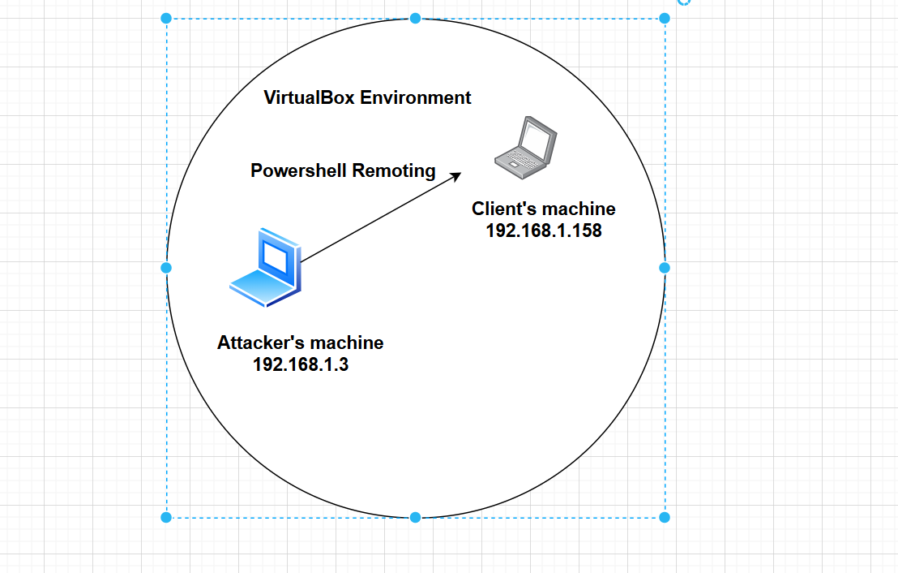
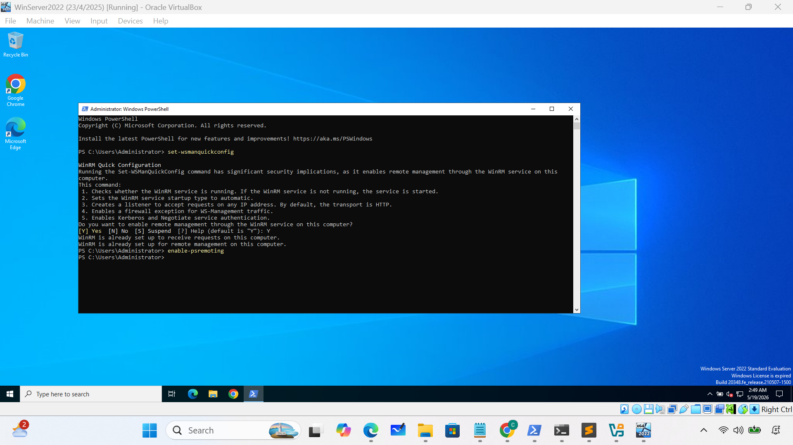
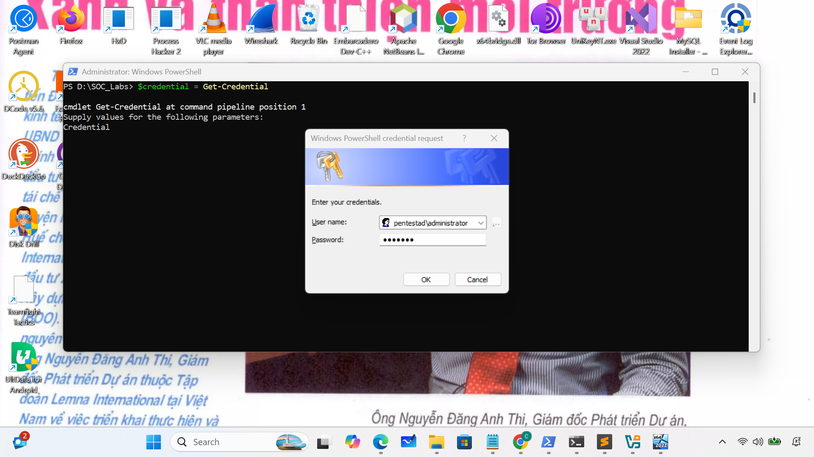
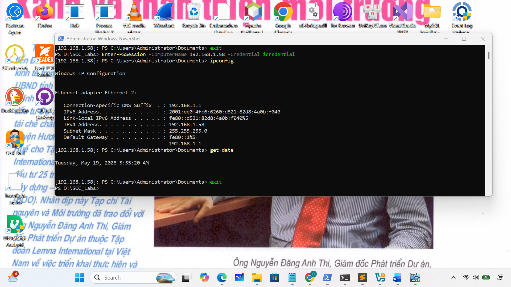
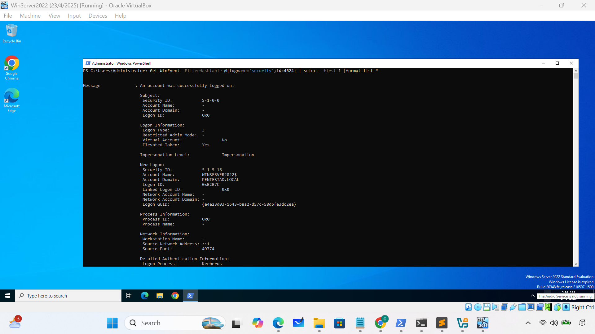
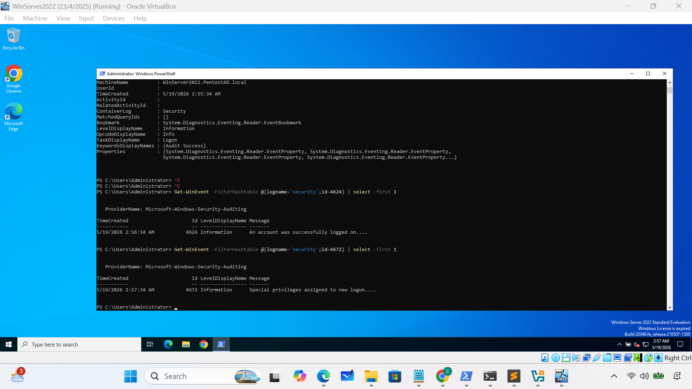
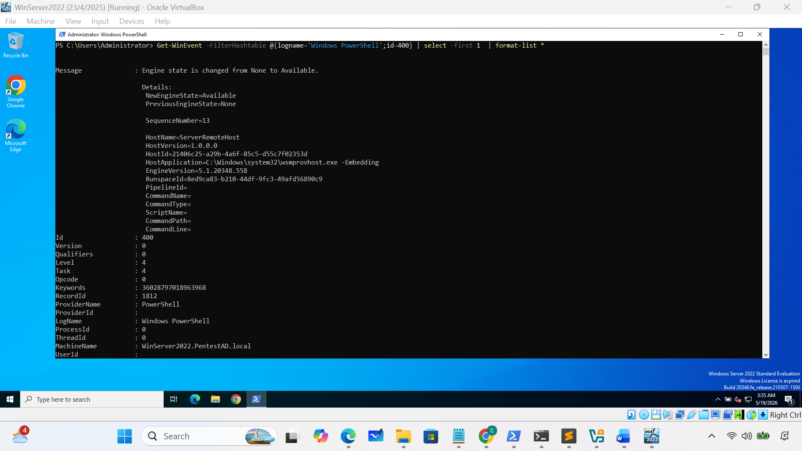

# 1.Powershell Remoting 
### 2.Important Events:
- **Security log:**
	- 4624 → Đăng nhập thành công -> Logon Type: 3 = Network logon
	- 4634 -> Đăng xuất
	- 4648 -> Explicit credentials được dùng
	- 4672 -> Đăng nhập với quyền đặc biệt (Admin)
### 3.Network diagram 

### 4. The process of analyzing:
	4624 (Logon Type 3)
	      ↓
	4672 (nếu admin)
	      ↓
	91 WinRM session created
	      ↓
	400 PowerShell engine started
	      ↓
	4103 / 4104 command execution
	      ↓
	403 engine stopped
	      ↓
	4634 logoff
### 5. Practice
- Configure on client side:
	Set-WSManQuickConfig
	Enable-PSRemoting

- Logon using Powershell remoting on attacker side:

- Switch on client side and analyze related event logs:
	**check EventID 4624**

	**check EventID 4672 wheather admin privilege was asigned to the session**

	**check EvenID 400: start a powershell session**

