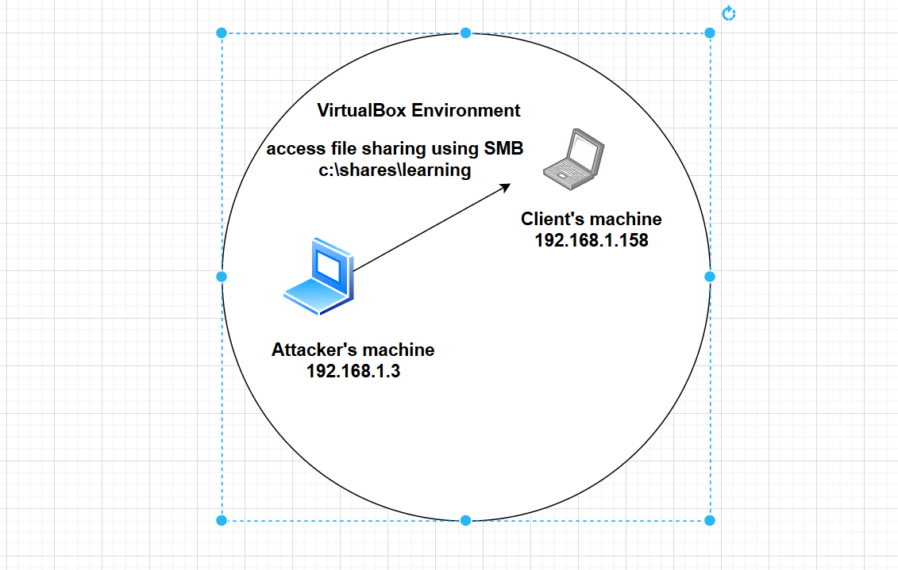
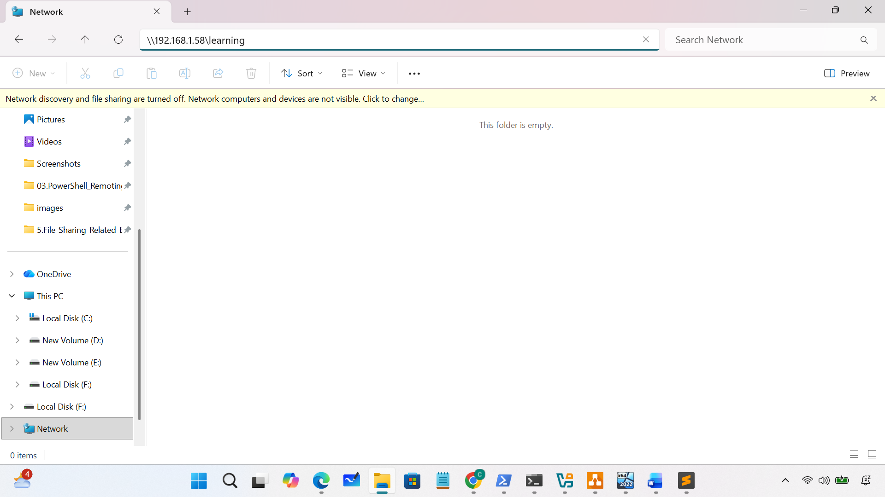
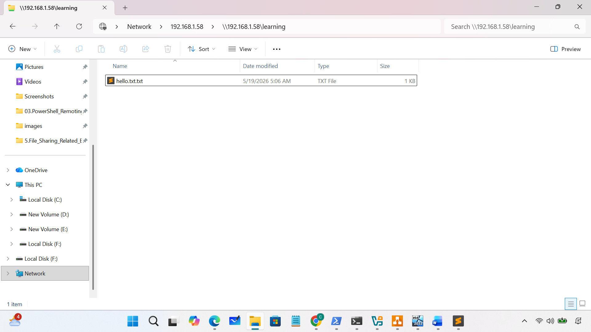
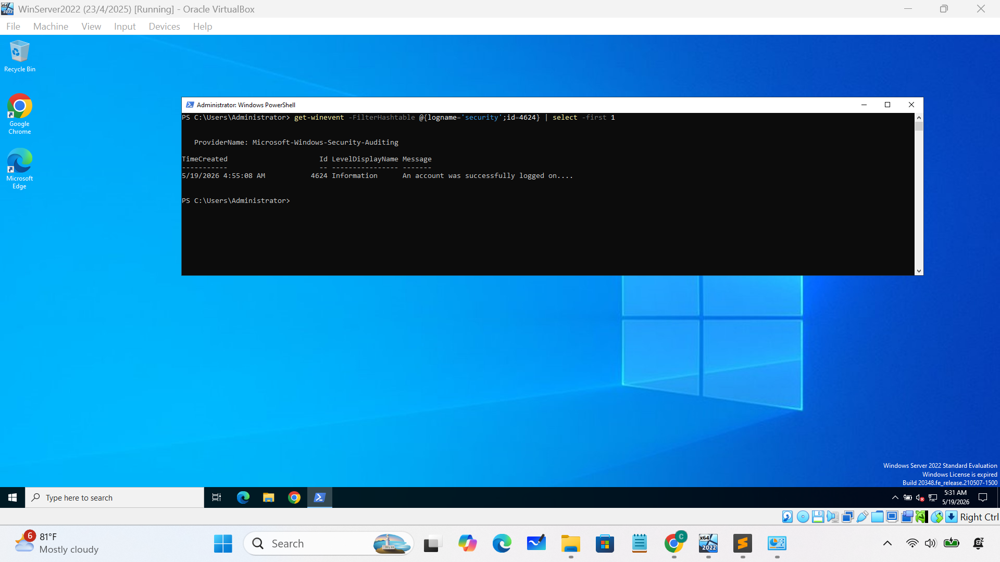
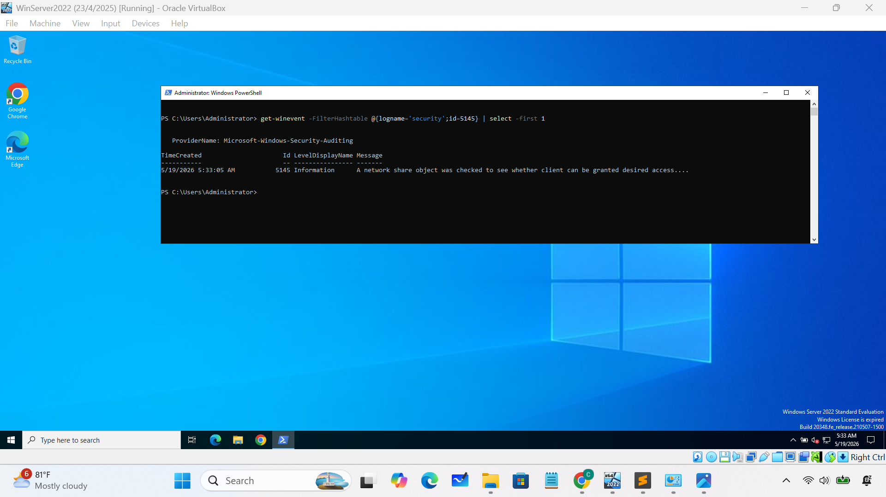
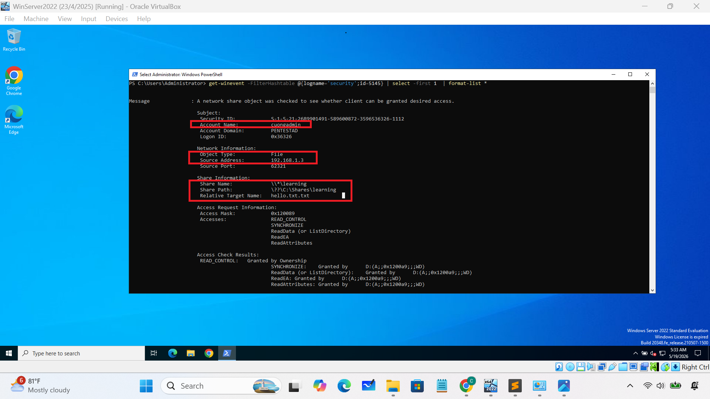

### 1. File Sharing
- SMB, network share, access directories
### 2. Important event IDs
- 4624 - Logon Successfully
- 5140 – A network share object was accessed
- 5142 – A network share object was added.
- 5143 - A network share object was modified
- 5144 - A network share object was deleted
- 5145 - Detailed File Share Access
### 3.Network diagram 

### 4. Practice
- Access file sharing on server using \\192.168.1.58\learning\

- Analyze 4624

- Analyze 5140

- Analyze 5145

