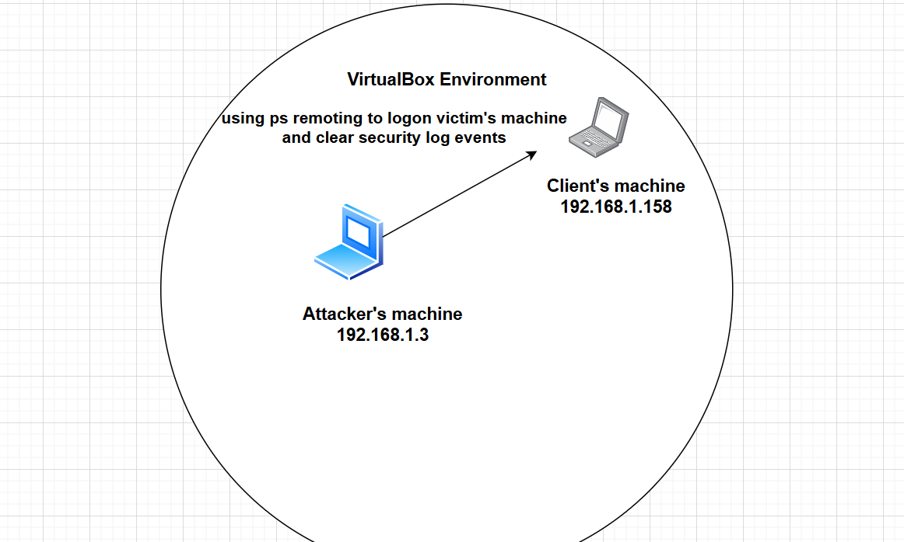
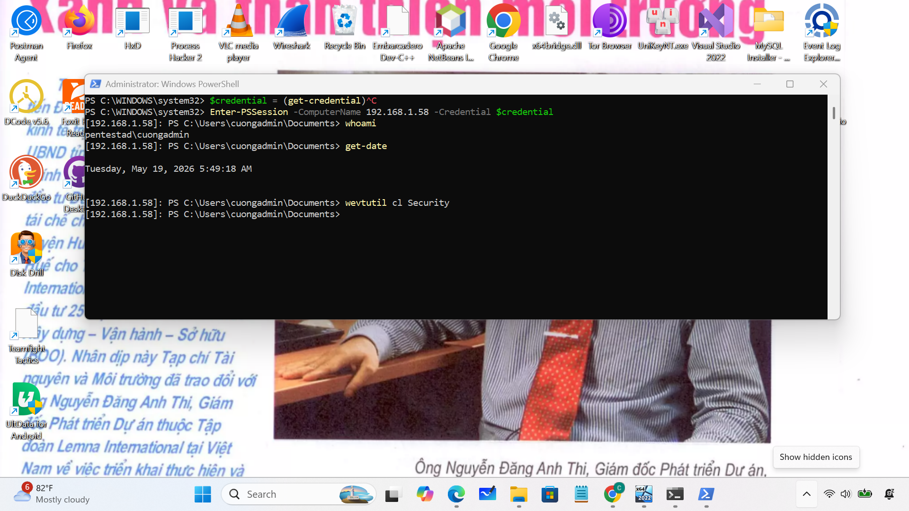
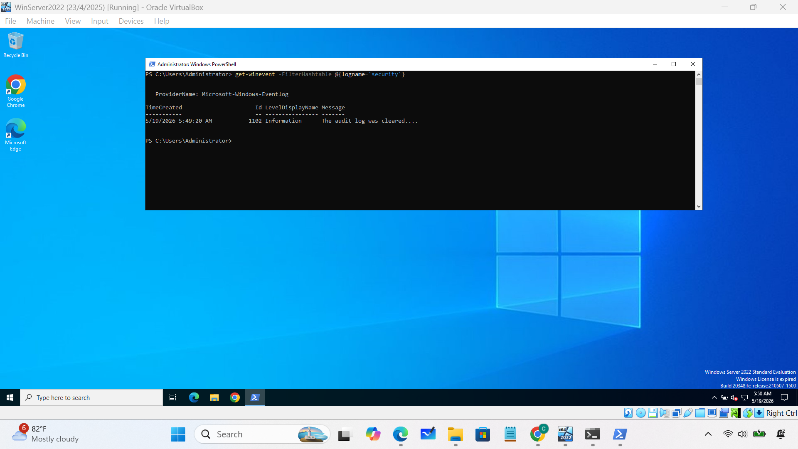
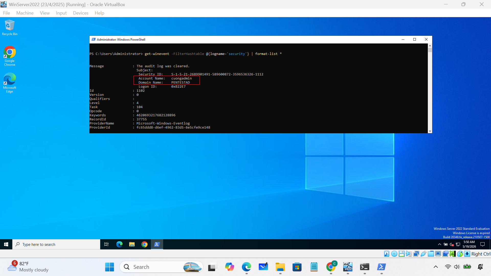

### 1. Clear logs:
### 2. Important event IDs
- Event ID 1102 (Security log cleared)
- Event ID 104 (System/Application log cleared)
### 3.Network diagram 

### 4. Practice
- Access victim's machine and clear logs:

- Check eventID: 1102

