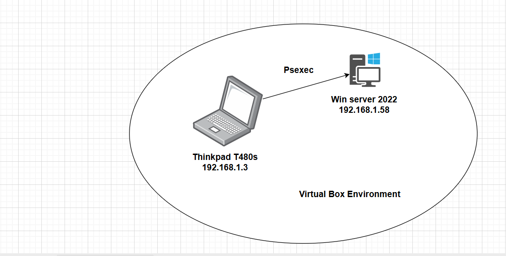
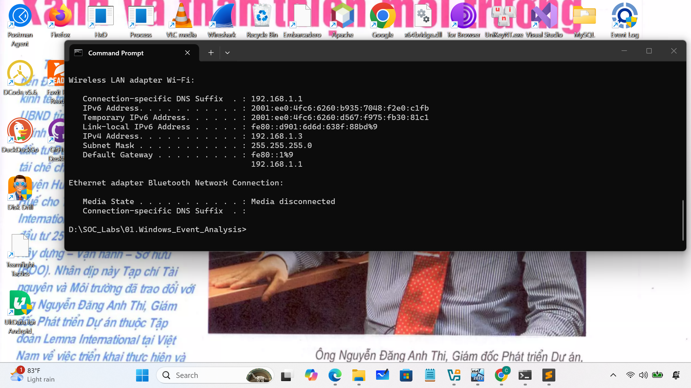
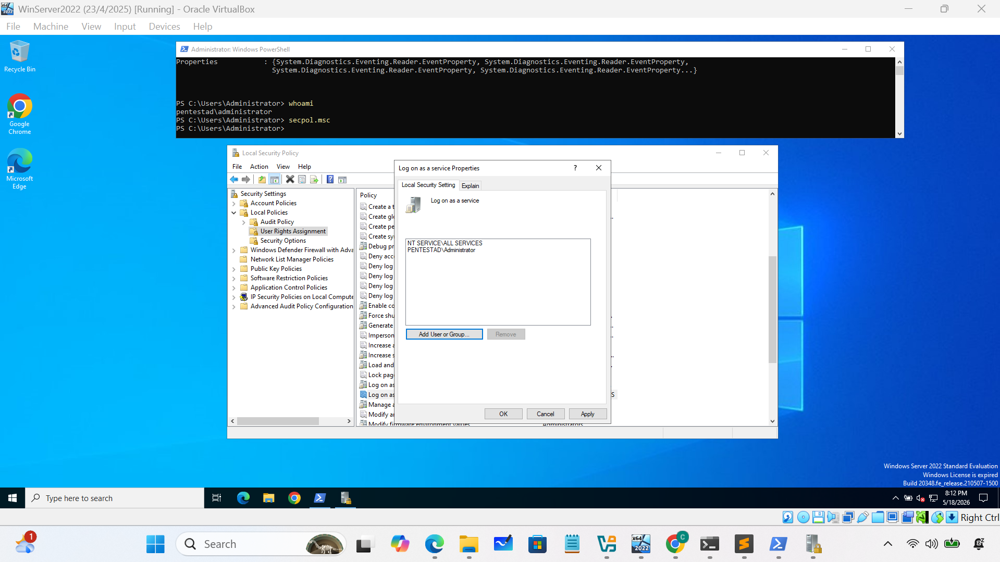
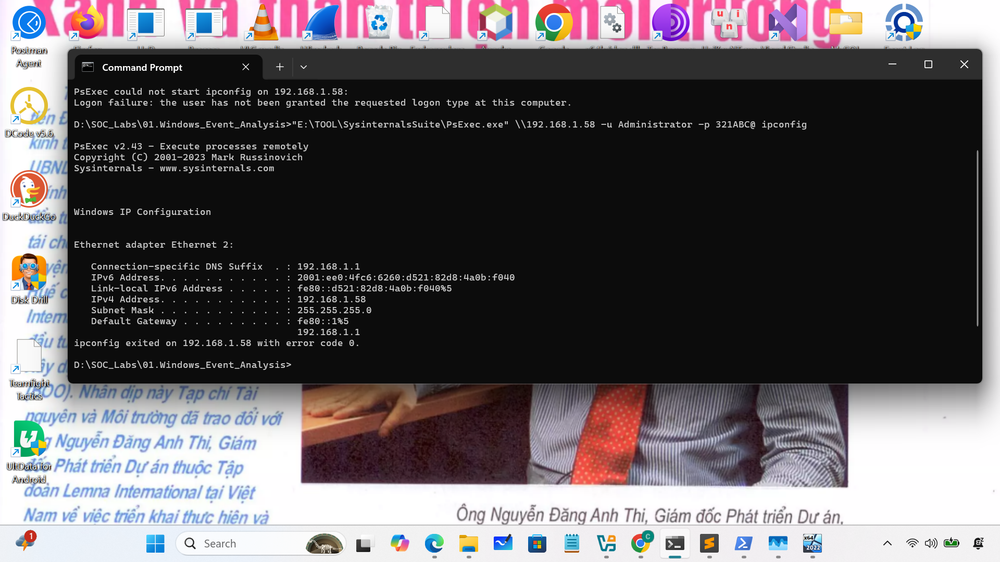
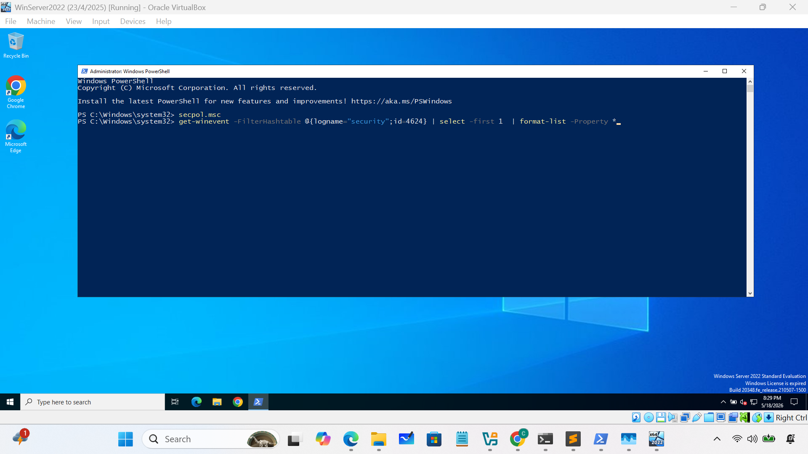
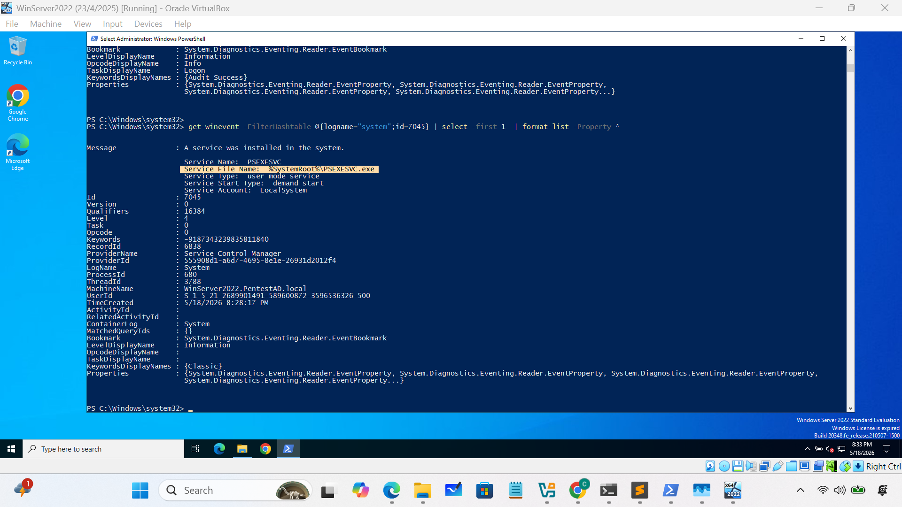

# Practice analyze PSExec 
### 1.PSExec
PSExec is a remote command execution tool for system administrators that is included in “Sysinternals Suite” tools, but this is often used for lateral 
movement in targeted attacks as well.
### 2.Typical behavior of PsExec
- It copies the PsExec service execution file (default: PSEXESVC.exe) to %SystemRoot% 
on remote computers with network logon (type 3)
- It registers the service (default: PSEXESVC), and starts the service to execute the 
command on the remote computer
- It stops the service (default: PSEXESVC), and removes the service on the remote 
computer after execution.
### 3.Important event IDs
	Security.evtx
		4624: An account was successfully logged on
	Ssystem.evtx
		7045: A service was installed in the system.
### 4.Network diagram 

### 5.Detect PSExec by the default service name

- **Logon Win server 2022**

- **Run PSExec at the attacker's machine:192.168.1.3**

	
 - **Met an error that the user has not been granted the requested logon type:**
 	Configure on win server to allow logon as a network service
 
 

- **Run PSExec again:**
 

- **Switch on win server 2022: analyze events**
 
 
 
 

- **In conclusion: **
We found: 
	 Event ID: 4624 with logon type 3 at 5/18/2026 8:29:25 PM.  
	 Event ID: 7045 with service name PSEXEC.exe at 5/18/2026 8:28:17 PM.   
Therefore, We can consider that attacker was used PSExec to launch an attack on win server 2022.   
### Detect PSExec by Finding changed service name