### 1. iptables + snort
### 2. network diagram
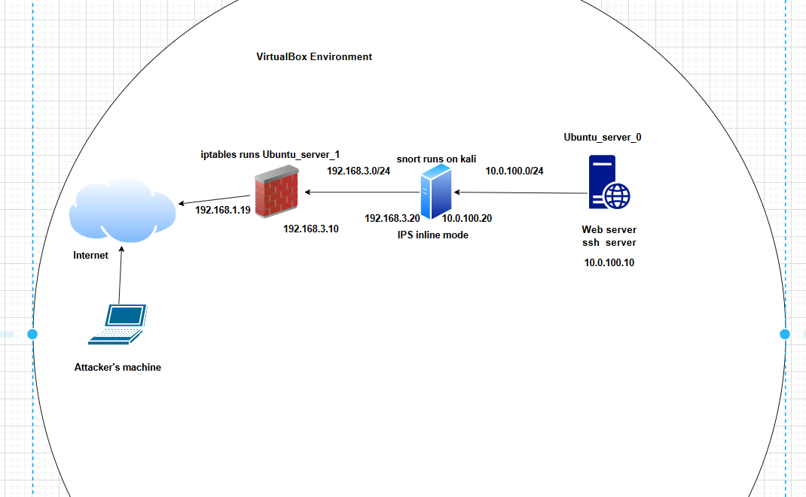
### 3. Setup
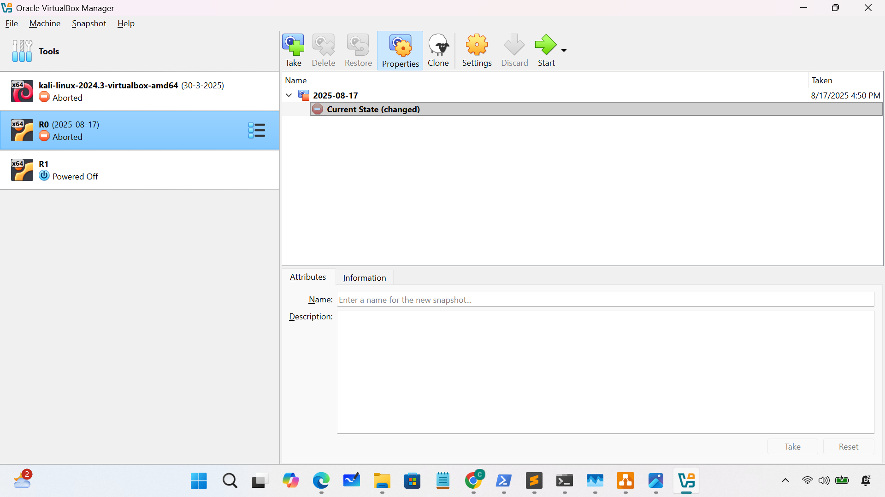
- **enable network adapter on ubuntu_server_0: internal network: 10.0.100.0/24**
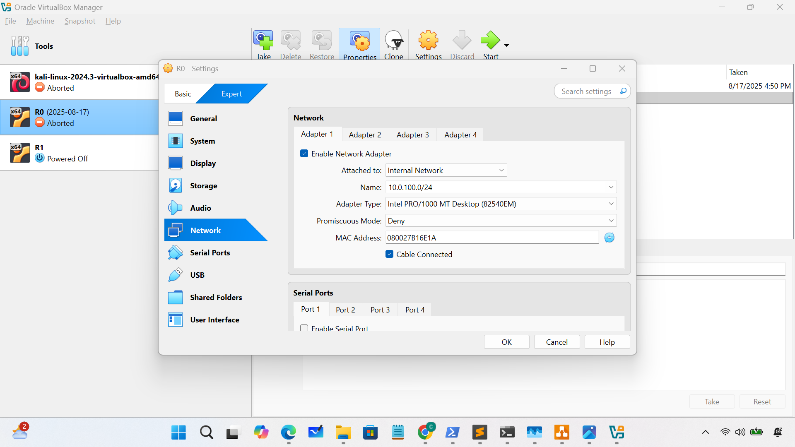
- **enable network adapter on kali:**
	- internal network 1: 10.0.100.0/24
	- internal network 2: 192.168.3.0/24
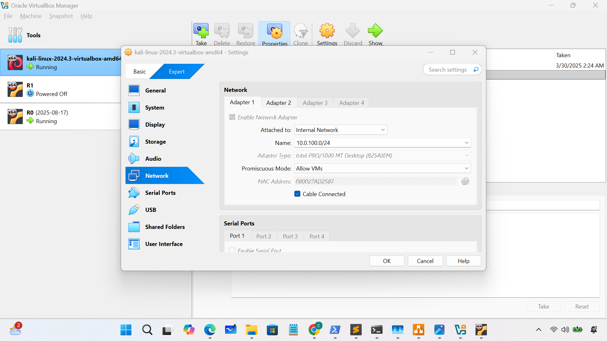
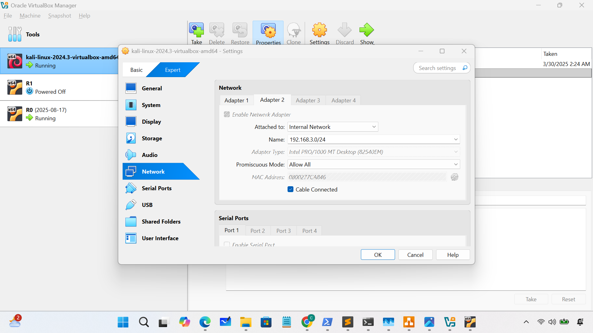
- **enable network adapter on ubuntu_server_1:**
	- internal network 1: 192.168.3.0/24
	- internal network 2: bridged adapter, which is used to connect to the Internet
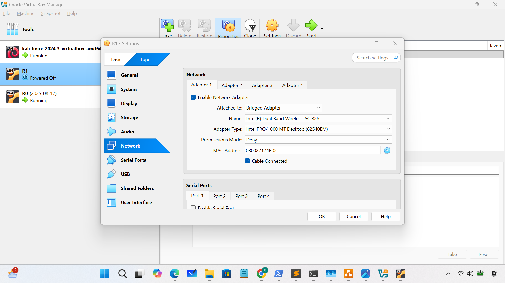
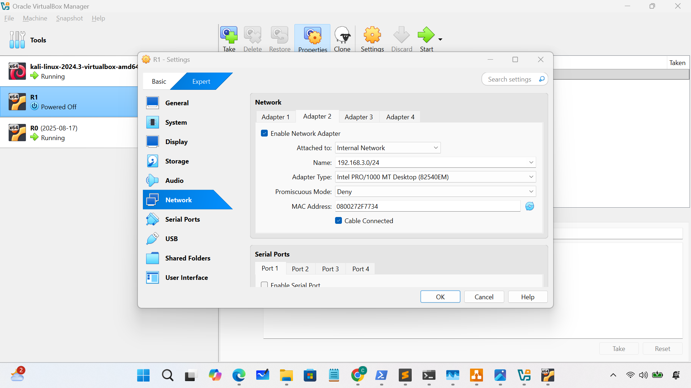
- **Configure on Ubuntu serser 0:**
	- set static ip and default gateway
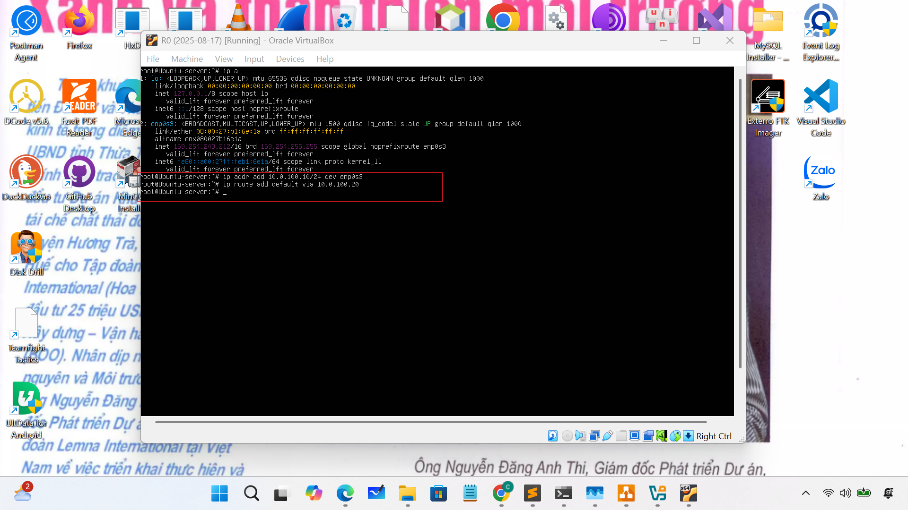
- **Configure on kali:**
	- set static ip/routes and ping test the connection
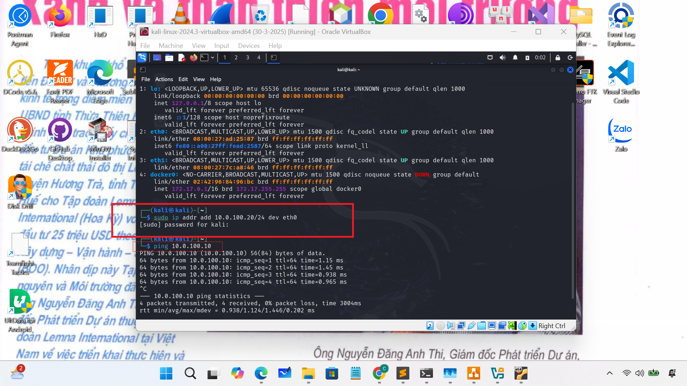
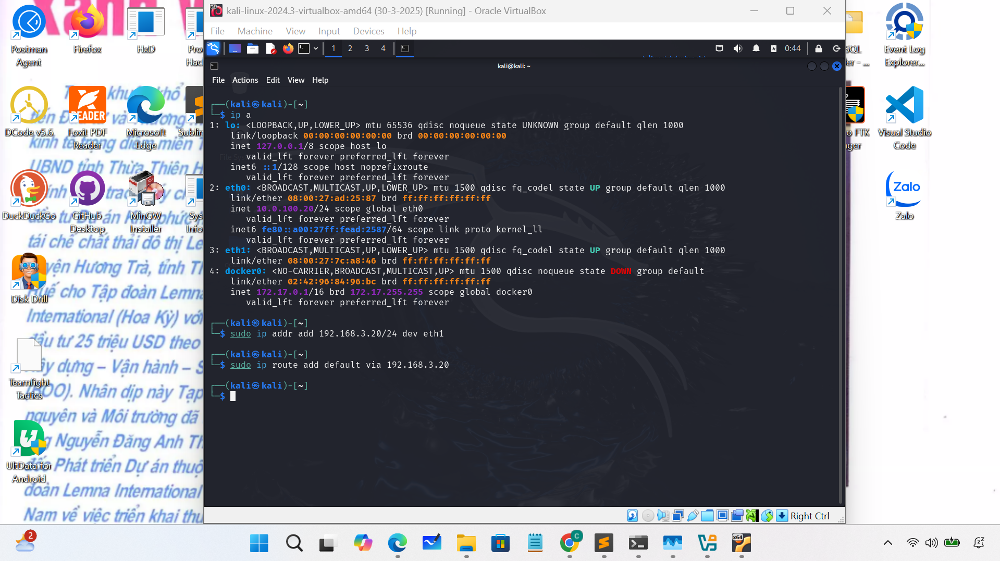
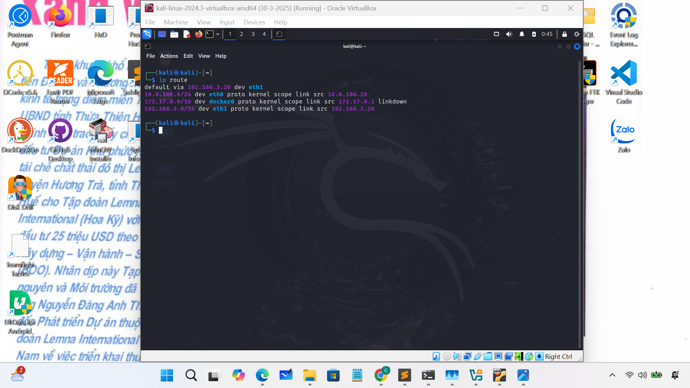
- **Configure on Ubuntu serser 1:**
	- set static ip/routes

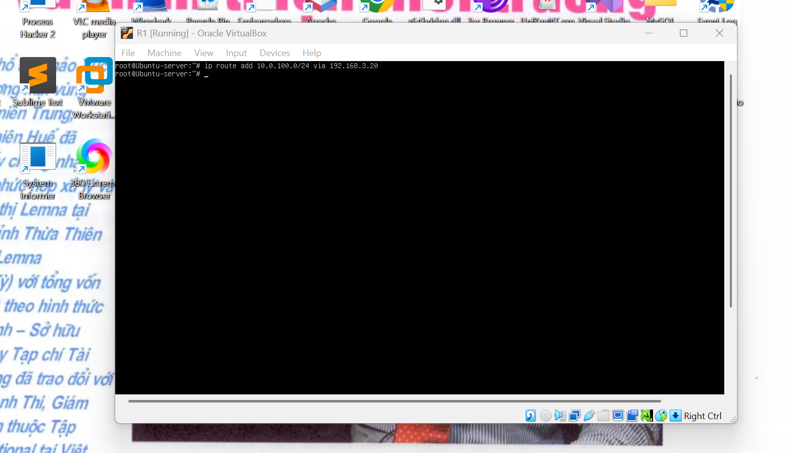
- **Configure iptables to allow traffic from nework access to webserver on ubuntu server 0**
	- **1. On kali**
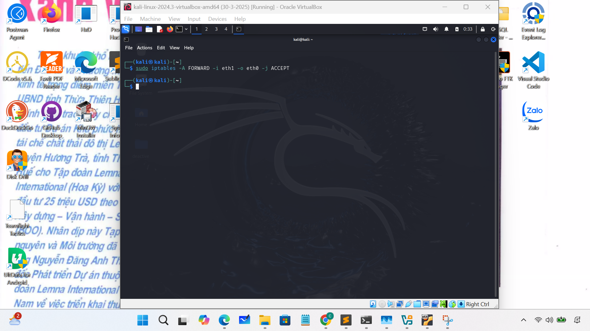
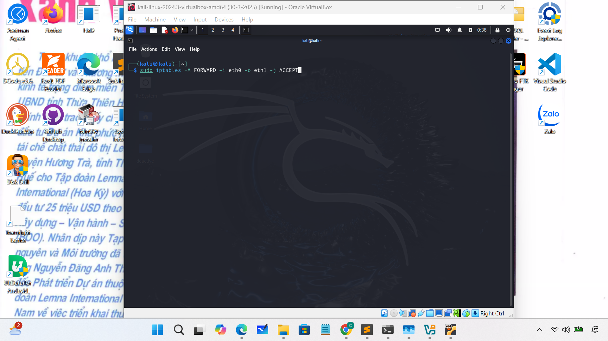
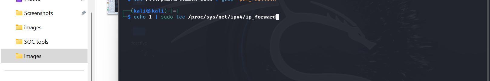
	- **2. On Ubuntu server 1: Test connection**
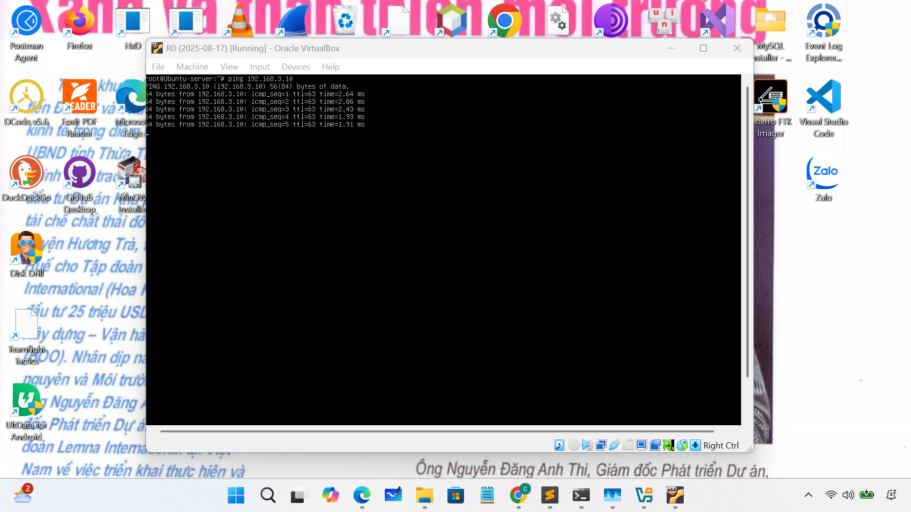