# Network Diagram

# Linux Logs
### 1. Linux Authentication Events

### 2. Top Source IP SSH Failed

### 3. SSH Login Geographic Map

### 4. Sudo Command Activity

# Spunk Dashboard for linux 

# Windows Logs

### 1. Login Success vs Failed
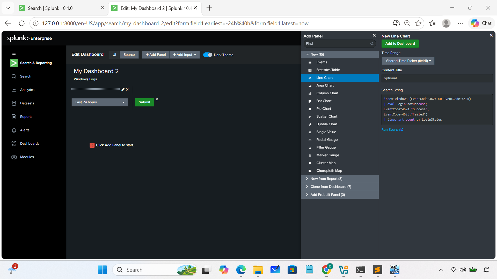
### 3. Process Creation Monitoring
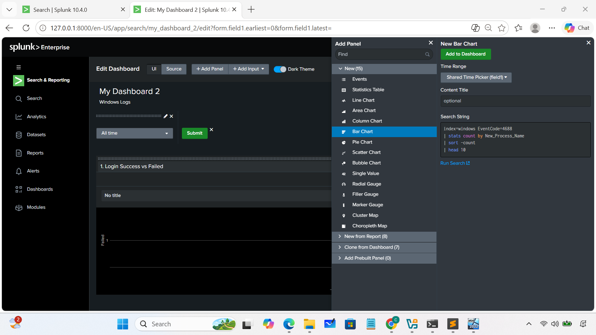
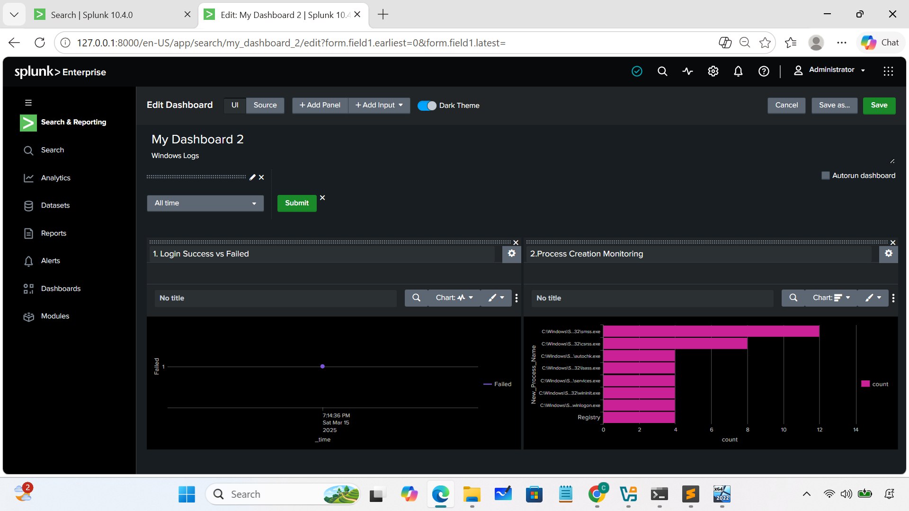
### 4. Suspicious PowerShell Activity
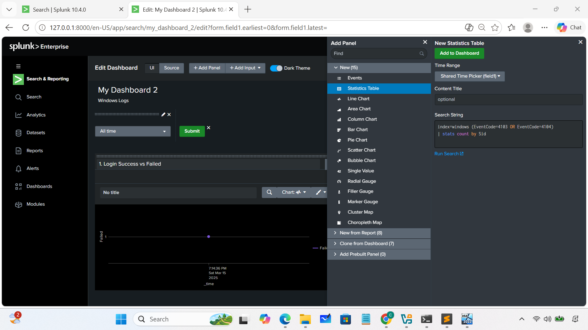
### 5. Service Creation / Modification
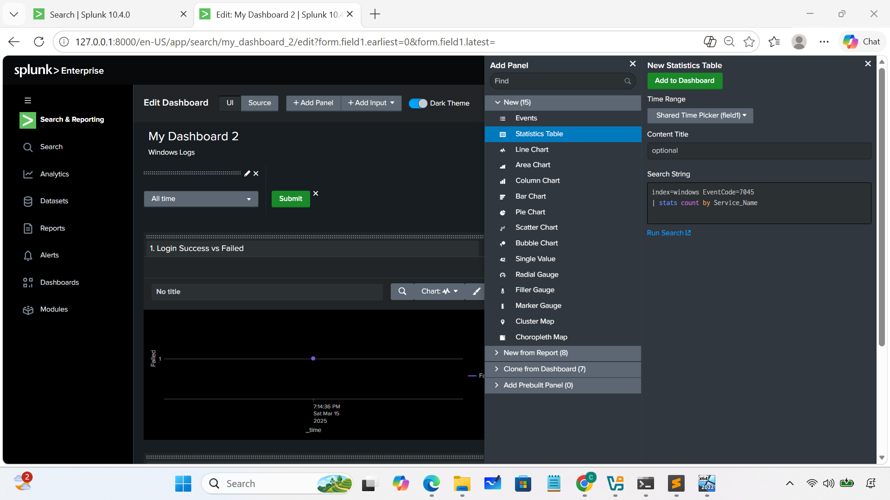
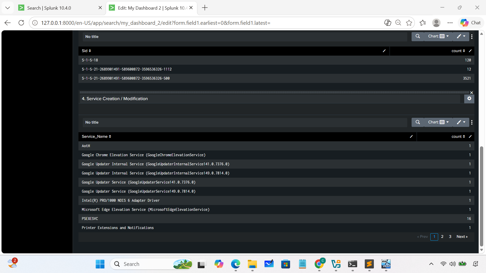

### 6. Security Summary (Single Values)
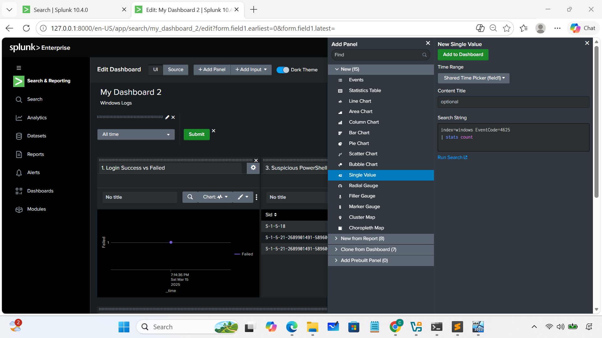
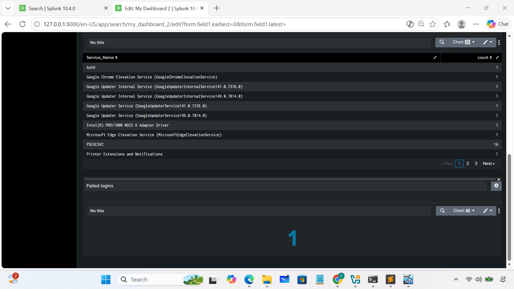
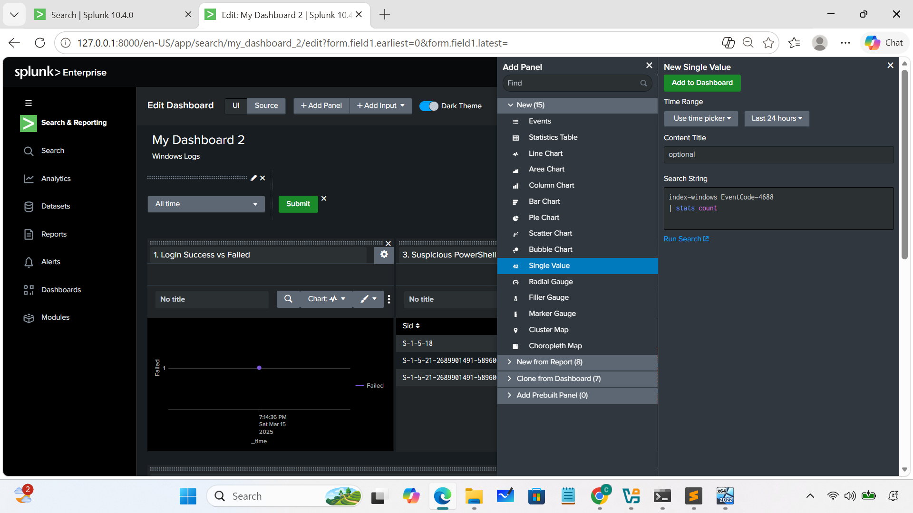
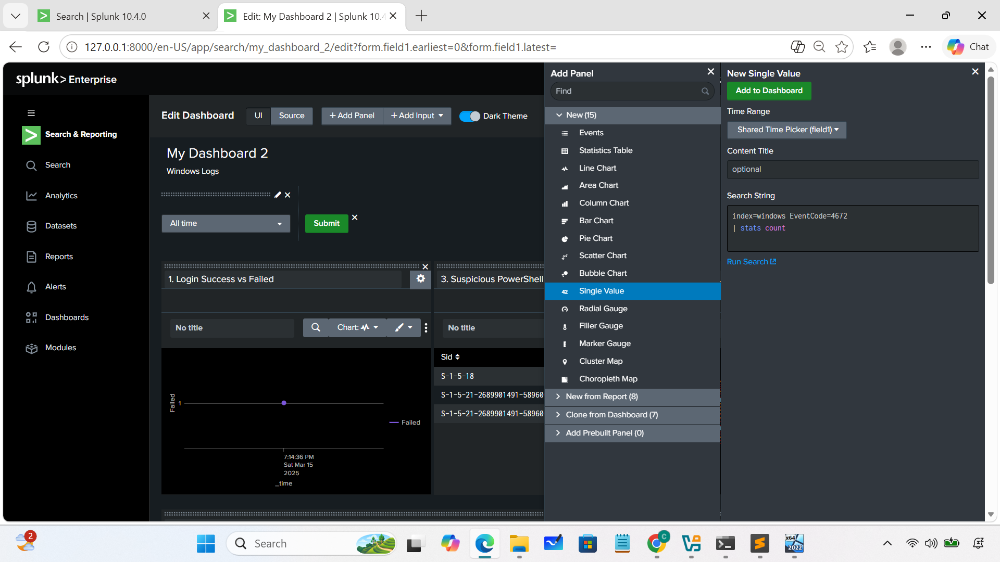
# Spunk Dashboard for linux 
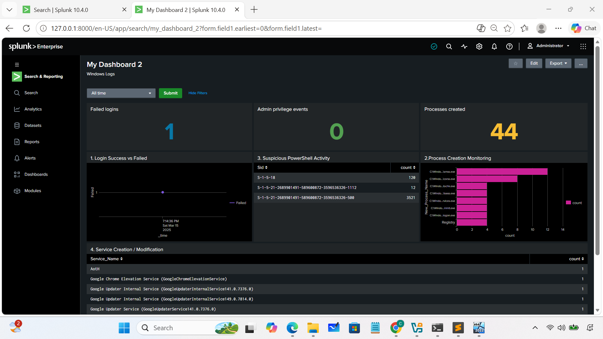